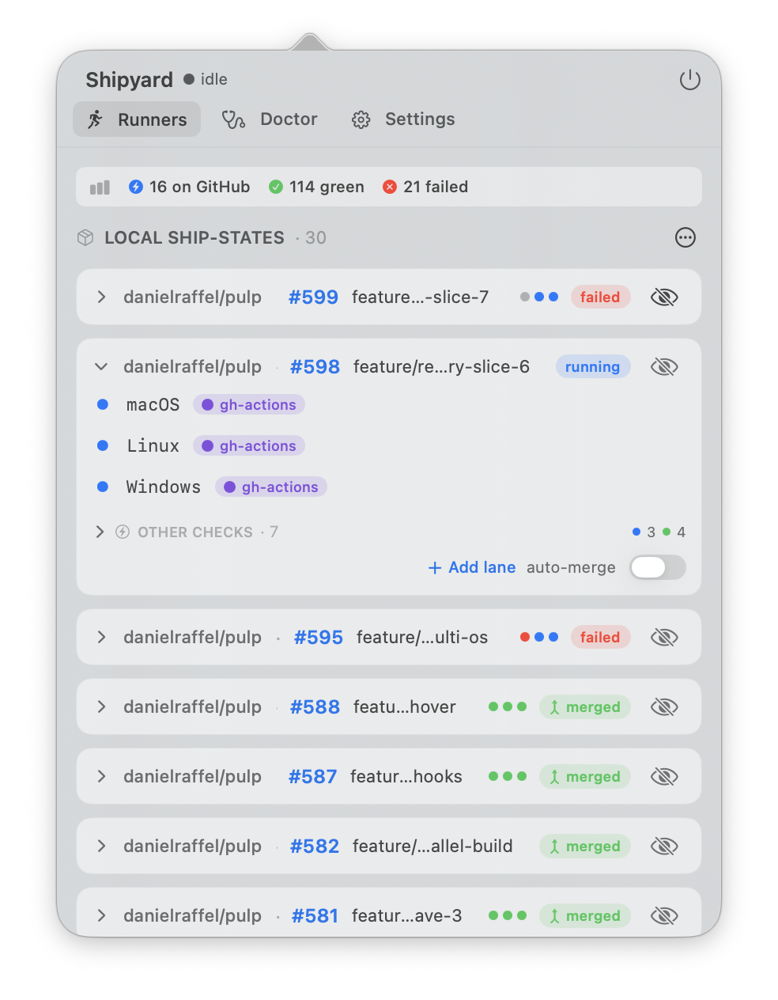
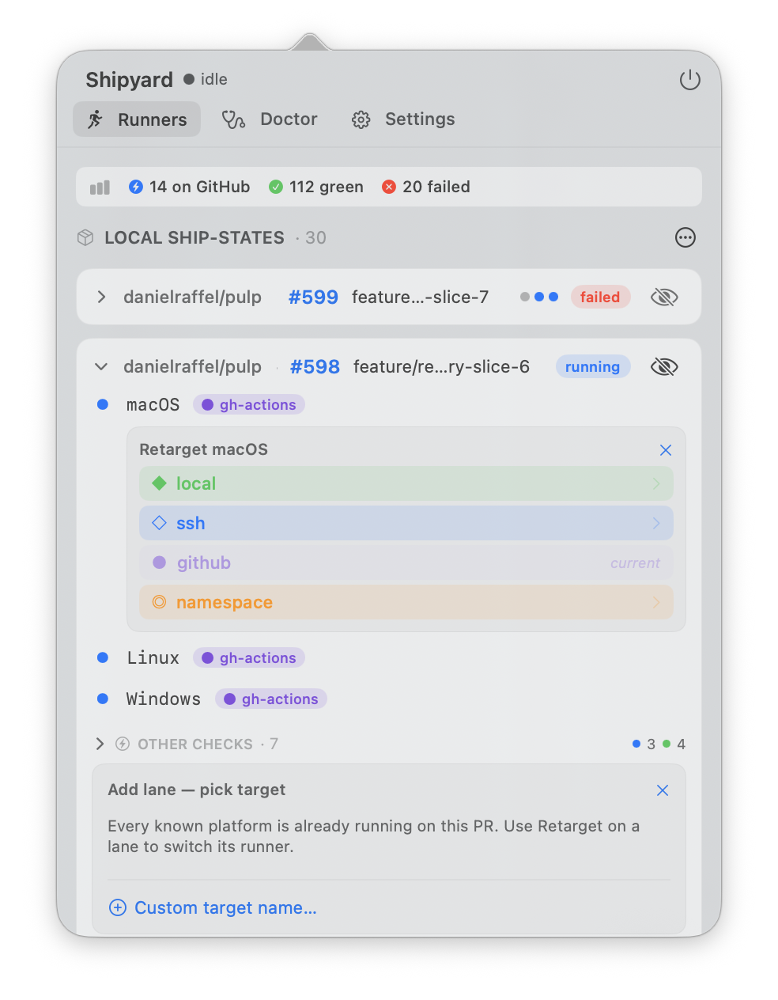
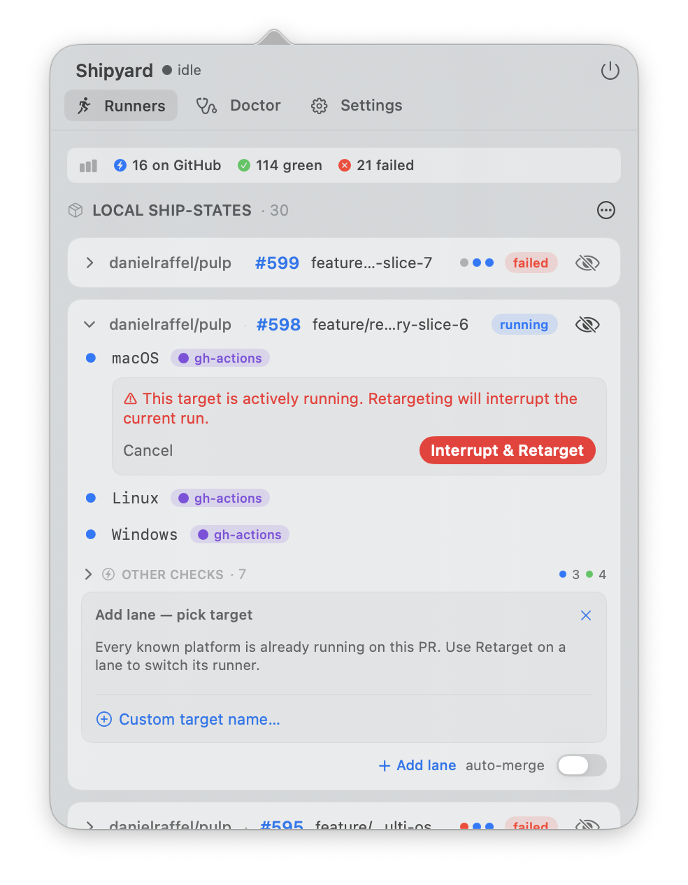
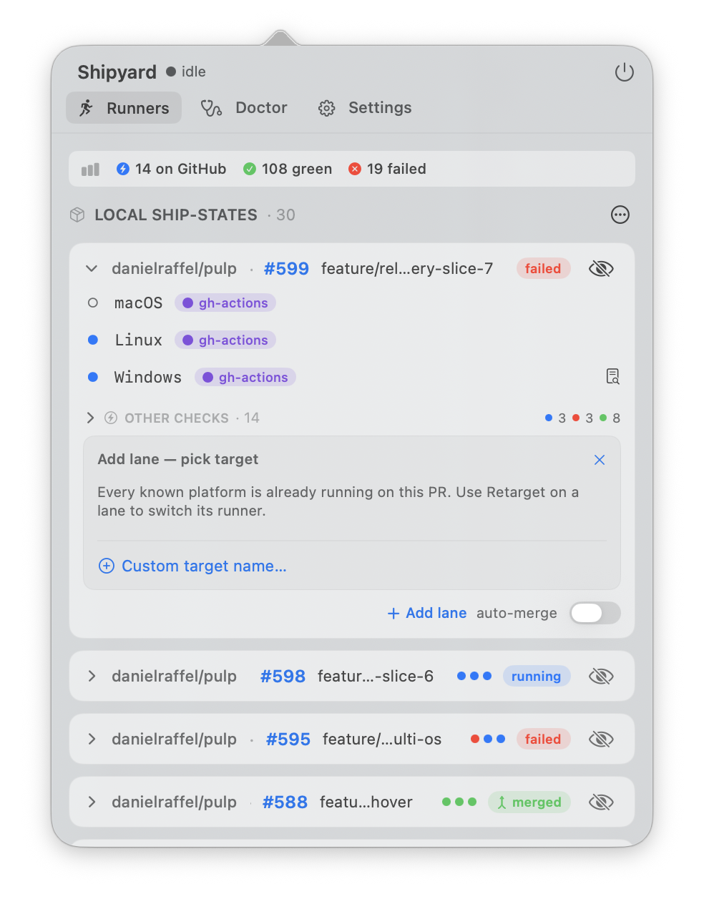
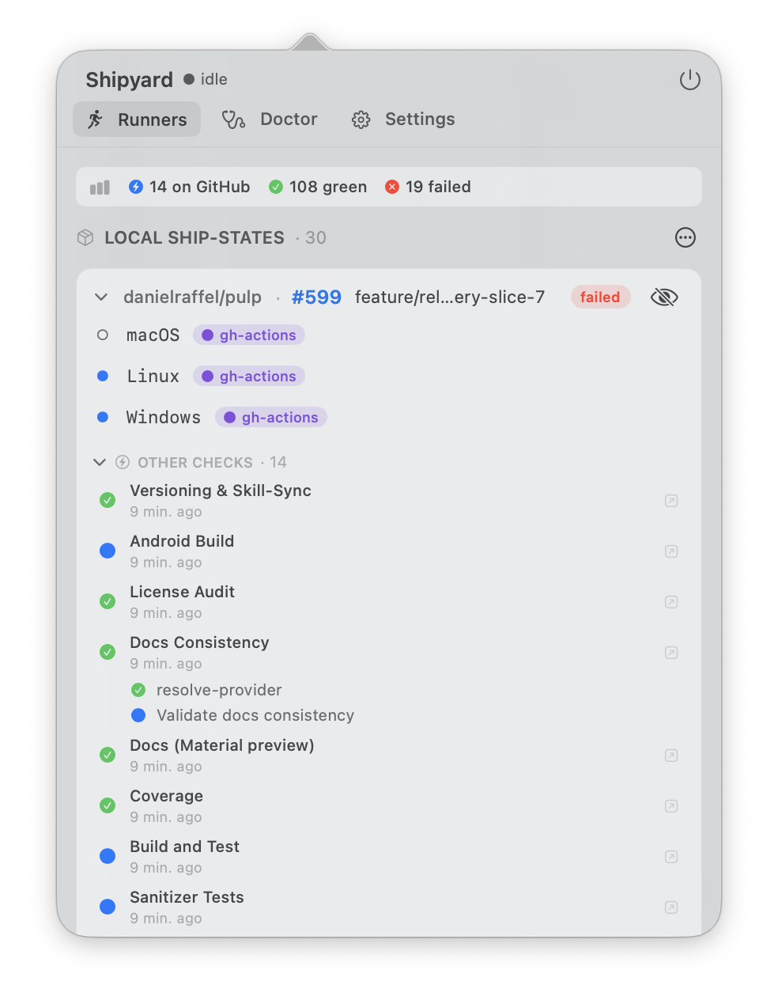

# Shipyard macOS

A native macOS menu-bar companion for [Shipyard](https://github.com/danielraffel/Shipyard) — the cross-platform CI controller.

## What it does

Shipyard itself runs in the terminal, and that's still the preferred way to
drive it. This app is a **quick glance** at what's happening without dropping
into a shell:

- See every in-flight PR's CI status in one popover — green / running / failed
  per platform.
- Click a job to **retarget** it to a different runner (GitHub-hosted →
  Namespace, or vice-versa) without editing workflow YAML.
- **Add a lane** (macOS / Linux / Windows / iOS / Android) to an in-flight PR
  without re-dispatching the whole matrix.
- Click straight through to the GitHub run, the PR, or logs.
- `shipyard doctor` output in a dedicated pane.
- Notifications on merge / fail / all-green.

It was my first test of [Claude Design](https://claude.ai/chat/design) — built
on an airplane — so treat the polish accordingly.

## Screenshots

| Active PR | Retarget | Confirm before interrupting |
|---|---|---|
|  |  |  |

| Add a lane | Other checks |
|---|---|
|  |  |

## Live mode (optional)

Sub-second CI status via webhooks instead of polling — no GitHub API
rate limits. Requires [Tailscale](https://tailscale.com) with
[Funnel](https://tailscale.com/kb/1223/funnel) enabled on your tailnet.
When enabled, Shipyard sets up the tunnel and registers webhooks
automatically; disabling reverses both.

Default is **Auto** (live when Tailscale is ready, polling at 60s when
it isn't). Set **On** to require live with a warning when unavailable,
or **Off** to force polling. Webhook events route through Tailscale's
edge directly to your Mac — no Shipyard-operated backend in between.

## Download

**[Latest signed & notarized DMG](https://github.com/danielraffel/shipyard-macos-gui/releases/latest/download/Shipyard.dmg)**

Requires macOS 13 Ventura or later. Drag from the DMG into `/Applications` and launch. The app lives in the menu bar — no dock icon.

Requires the `shipyard` CLI on your `PATH` (auto-discovered at `/usr/local/bin`, `/opt/homebrew/bin`, or `~/.pulp/bin`).

## Build locally

```bash
git clone git@github.com:danielraffel/shipyard-macos-gui.git
cd shipyard-macos-gui
brew install xcodegen
./scripts/bootstrap.sh          # generates ShipyardMenuBar.xcodeproj
open ShipyardMenuBar.xcodeproj  # or: ./scripts/build.sh Release
```

For unsigned local debug, set `CODE_SIGN_STYLE: Automatic` with no team in `project.yml`, regenerate with `xcodegen generate`, and use a Debug build.

## Release

Tag-triggered, local-only — no GitHub Actions. The stable download URL (`releases/latest/download/Shipyard.dmg`) always points at the newest release.

If you're working with Claude Code, say **"push a build"** and it'll handle the full flow (see `CLAUDE.md`). Manually:

```bash
# 1. Bump MARKETING_VERSION in project.yml, commit.
git tag v1.0.0
git push --tags
./scripts/release.sh            # reads tag from HEAD
```

`release.sh` validates the tag against `project.yml`, archives, signs, notarizes the `.app` and the DMG, staples both, and publishes via `gh release`. Idempotent on re-runs (`--clobber`).

Credentials live in `~/.config/shipyard-macos-gui.env` (gitignored):

```
APPLE_ID=you@example.com
TEAM_ID=XXXXXXXXXX
APP_SPECIFIC_PASSWORD=abcd-efgh-ijkl-mnop
```

Add `--draft` for a dry-run that publishes as a draft.

## Project layout

```
shipyard-macos-gui/
├── project.yml                     # xcodegen spec (source of truth)
├── CLAUDE.md                       # agent shortcuts: "push a build" etc.
├── Sources/ShipyardMenuBar/
│   ├── ShipyardMenuBarApp.swift    # @main
│   ├── Models/Models.swift         # Ship, Target, Runner, status enums
│   ├── Services/
│   │   ├── AppStore.swift          # central @MainActor state
│   │   ├── StatusItemController.swift  # NSStatusItem + NSPopover
│   │   └── ShipyardCLIRunner.swift # NDJSON subprocess actor
│   └── Views/                      # SwiftUI views
├── scripts/
│   ├── bootstrap.sh                # xcodegen generate + signing check
│   ├── build.sh                    # xcodebuild archive
│   ├── notarize.sh                 # notarytool submit + staple
│   └── release.sh                  # full tag → DMG → release pipeline
└── docs/ARCHITECTURE.md
```

## License

[MIT](LICENSE).
