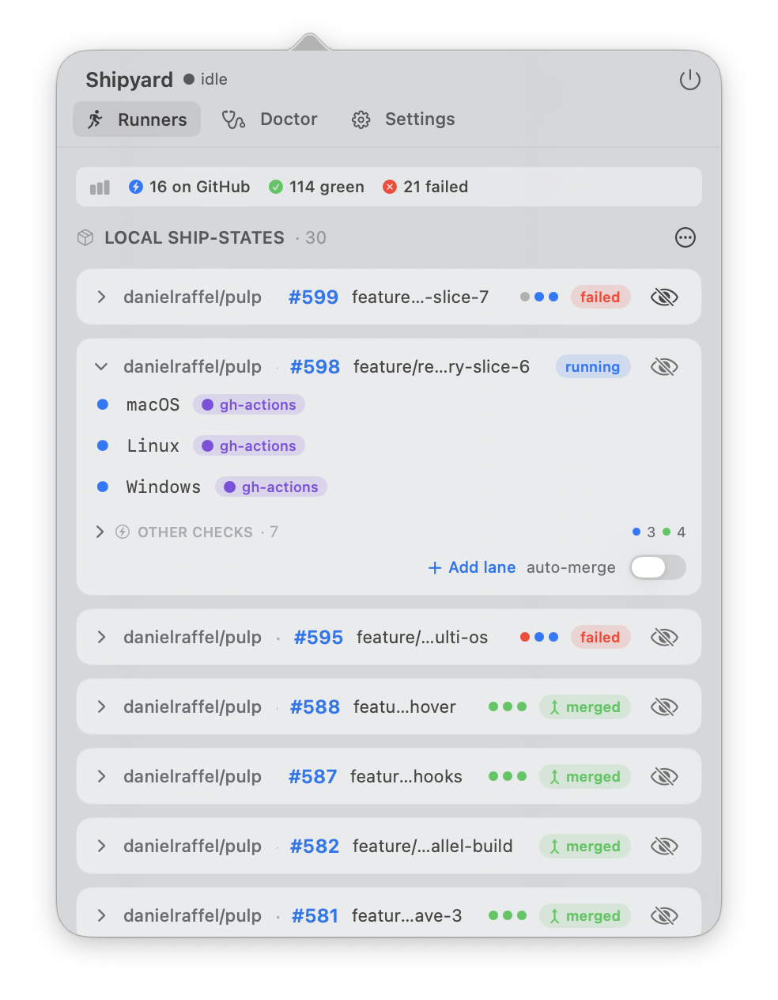
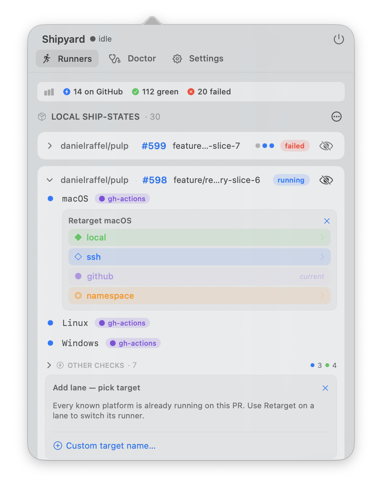
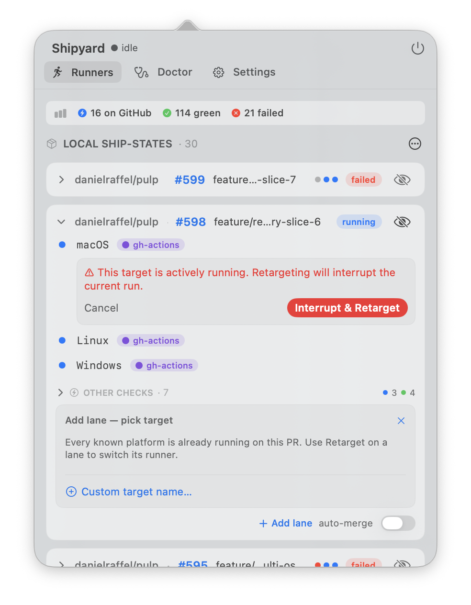
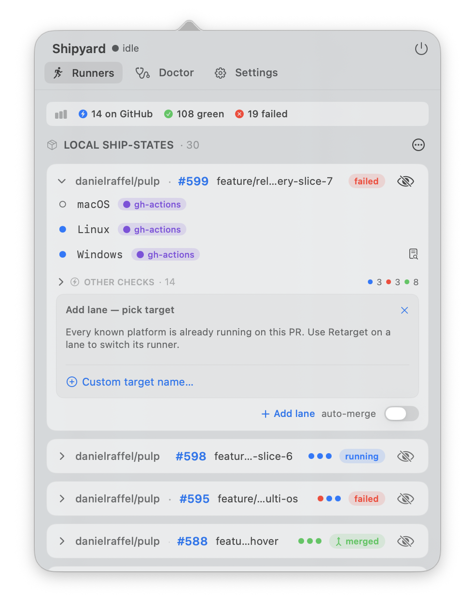
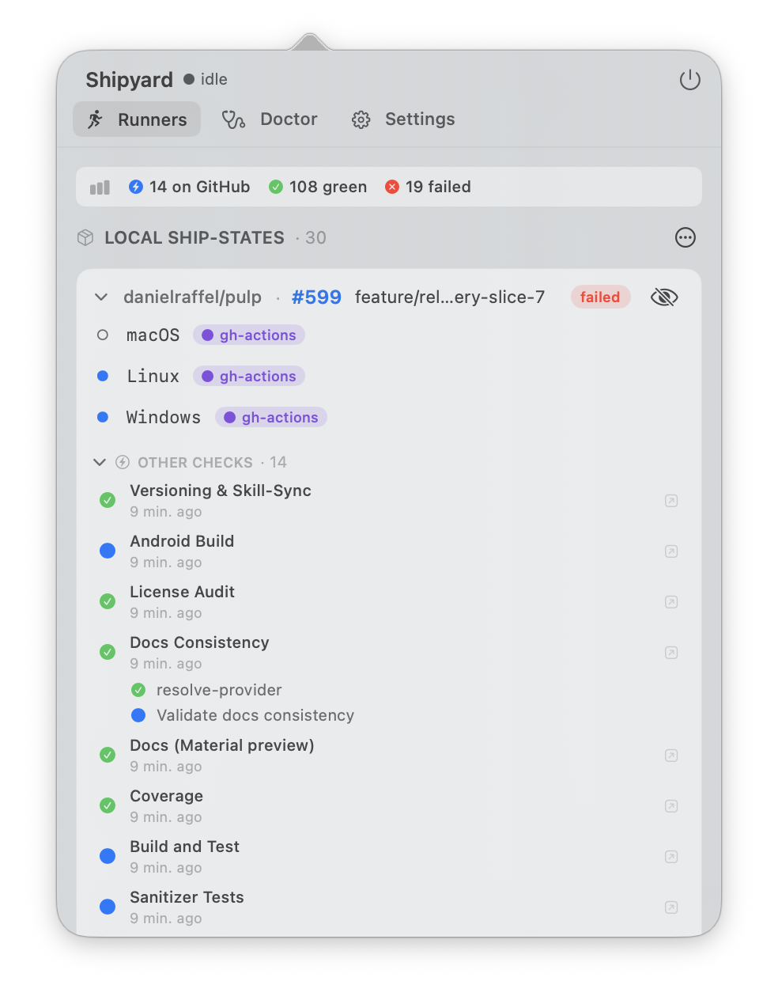

# Shipyard MenuBar for macOS

A native macOS menu-bar companion for [Shipyard](https://github.com/danielraffel/Shipyard) — the cross-platform CI controller.

## What it does

Shipyard itself runs in the terminal, and that's still the preferred way to
drive it. This app is a **quick glance** at what's happening without dropping
into a shell:

- See every in-flight PR's CI status in one popover — green / running / failed
  per platform.
- Click a job to **retarget** it to a different runner (GitHub-hosted →
  Namespace, or vice-versa) without editing workflow YAML.
- **Add a lane** (macOS / Linux / Windows / iOS / Android) to an in-flight PR
  without re-dispatching the whole matrix.
- Click straight through to the GitHub run, the PR, or logs.
- See active Namespace runner instances from `nsc list` without spending
  GitHub API quota.
- **Serve CI from this Mac** — per-lane toggles (auto-discovered: macOS gate /
  release / sanitizer, Linux, Windows) plus a master "all lanes" switch to pull
  your machine in or out of the build pool, and a host-wide macOS-VM cap.
- **Governor panel** — a "see what the governor sees" read-out of this Mac's
  live vitals (1-minute load, memory pressure, available RAM) and the tartci
  host build-lease usage (cores / RAM leased vs. the host budget, leases held).
  Load + memory are read in-process; the lease figures come from shelling
  `tartci leases --json` (falling back to `tartci status --json`), so the panel
  reads "governor not installed" on a host without tartci. A **native-build
  participation** toggle writes `~/.config/tartci/native-build-participation`
  (`1`/`0`) — a sibling of the serve-CI switch that additionally lets a future
  governor refuse to place a native-build lease on an opted-out host.
- **See other Macs' PRs** — a machine selector on Tracked PRs (This Mac / All /
  per-machine) reads each Mac's *local* ship-state over Tailscale, so you can
  glance at what M1 / Studio are managing **without spending any GitHub API
  quota**.
- **Group untracked Actions runs** by All / by-machine / by-runner.
- `shipyard doctor` output in a dedicated pane.
- Notifications on merge / fail / all-green.

GitHub status polling can run through a **GitHub App installation token** (its own
12,500/hr bucket) instead of your personal 5,000/hr PAT — the app prefers `ghapp`
when it's installed and falls back to `gh`. Combined with live mode (below), the
app is designed to stay well clear of your rate-limit budget.

It was my first test of [Claude Design](https://claude.ai/design) — built
on an airplane — so treat the polish accordingly.

## Screenshots

| Active PR | Retarget | Confirm before interrupting |
|---|---|---|
|  |  |  |

| Add a lane | Other checks |
|---|---|
|  |  |

## Live mode (optional)

Sub-second CI status via webhooks instead of polling — no GitHub API
rate limits. Requires [Tailscale](https://tailscale.com) with
[Funnel](https://tailscale.com/kb/1223/funnel) enabled on your tailnet.
When enabled, Shipyard sets up the tunnel and registers webhooks
automatically; disabling reverses both.

Default is **Auto** (live when Tailscale is ready; GitHub API polling
paused when it is not). Set **On** to require live with a warning when
unavailable, or **Off** to force polling. Webhook events route through
Tailscale's edge directly to your Mac — no Shipyard-operated backend in
between.

Webhook registration needs the token Shipyard uses to be allowed to manage repo
hooks. **How you grant that depends on which kind of token you authenticate
with** — the in-app hint only covers the first case:

- **User PAT / OAuth (the default `gh auth login`):** grant the
  `admin:repo_hook` scope. The app shows a copy button for:

  ```bash
  gh auth refresh -h github.com -s admin:repo_hook
  ```

- **GitHub App installation token** (e.g. a `[github.auth] token_command`
  helper in `shipyard`'s config): installation tokens have **App permissions**,
  not OAuth scopes, so `gh auth refresh -s admin:repo_hook` does nothing. Instead,
  on the GitHub App, add **Repository permissions → Webhooks → Read & write**,
  then approve the updated permission on the installation. Because installation
  tokens bake in their permissions at mint time (~1 h TTL), **restart the daemon
  afterward** (quit + reopen Shipyard) so it mints a fresh token that includes
  the new permission — otherwise webhook creation keeps failing with
  `403 "Resource not accessible by integration"` until the cached token expires.

If neither is satisfied the app pauses GitHub API polling (the header shows
"updates paused") and live updates stay off until webhooks can register.

## Download

**[Latest signed & notarized DMG](https://github.com/danielraffel/shipyard-macos-gui/releases/latest/download/Shipyard.dmg)**

Requires macOS 13 Ventura or later. Drag from the DMG into `/Applications` and launch. The app lives in the menu bar — no dock icon.

Requires the `shipyard` CLI. The app uses the selected path from
Settings when provided, otherwise it auto-discovers `/usr/local/bin`,
`/opt/homebrew/bin`, `~/.pulp/bin`, then the canonical Rust install at
`~/.local/bin/shipyard`.

When the selected CLI supports `shipyard --json paths`, the app derives
the daemon socket, pid file, and daemon directory from that CLI so
side-by-side validation builds and production installs do not collide.
Older CLIs fall back to the legacy
`~/Library/Application Support/shipyard/daemon` socket.

The Tailscale App Store build is supported for live mode; the app probes
`/Applications/Tailscale.app/Contents/MacOS/Tailscale` before Homebrew
or system PATH locations.

## Serve CI builds from this Mac

If this Mac is set up as a self-hosted runner, **Settings → Serve CI builds from
this Mac** shows one toggle per **lane this host actually has** — discovered by
scanning its runner launchd agents, so each Mac shows its real lanes (e.g. macOS
gate / release / sanitizer, Linux, Windows) rather than a hardcoded set. Flip a
lane **on** and the Mac joins that part of the pool and runs CI jobs in throwaway
VMs; flip it **off** while you're working so builds don't run on your machine.

- **Master "All lanes" switch** (shown when there's more than one lane) joins or
  leaves the whole pool in one tap. It delegates to the **`tartci pool
  {on|off}`** CLI, so the app and the command line are one host-level opt-out —
  flipping it here is identical to running `tartci pool off` in a terminal, and
  they can never drift. Turning everything off mid-build warns first, summing the
  in-progress builds across lanes. Because it goes through `tartci pool`, the
  master switch also covers the host's **GitHub-native `actions.runner.*`
  agents** (not just the lanes the per-lane list discovers) and writes the
  governor's native-build participation flag; the header's *participating* state
  is read from `tartci pool status --json`. If `tartci` isn't on `PATH`, it falls
  back to toggling each discovered lane directly. See tartci's
  `docs/runbook.md` → "Opt a host out of the CI pool".
- Each **per-lane** toggle loads/unloads that lane's launchd agent for granular
  control and reflects live state — *Not set up on this Mac*, *Not serving*,
  *Serving · idle*, *Waiting · N ready* (a warm VM available for work), or
  *Building N jobs* — derived from the GitHub **runner** state for that lane's
  labels.
- **Max macOS VMs at once** — a 1–2 control (Apple allows two macOS guests per
  host). Set it to 1 to keep a slot free while you work. The tartci macOS runners
  read it live, so changes take effect without reloading anything.

## Namespace instances

When `nsc` is installed and authenticated, the Runners view shows raw
Namespace instances every 30 seconds via `nsc list --all -o json`. These
rows are runner VMs, not PRs or GitHub jobs. The UI mirrors Namespace Cloud's
shape vocabulary where `nsc` exposes it: active instance, instance ID, platform
(`mac/silicon`, `linux/amd64`, `win/amd64`), and size (`6x14`, `4x8`).
When an already-cached GitHub job reports `runner_name: nsc-runner-<instance>`,
the row also shows workflow/branch/short SHA and links to the matching
Namespace Cloud job page. Expanding an unmatched row falls back to
`nsc describe <instance> -o json` for container readiness when Namespace still
has detail for that ephemeral instance, and provides copyable `nsc describe`,
`nsc top`, and `nsc logs` commands.

The app shows every active instance returned by `nsc list`. It does not merge
or hide rows against GitHub Actions because `nsc` does not expose stable job
IDs locally; instead, the Runners view keeps Namespace instances in their own
infrastructure section so the UI does not imply a PR/job mapping it cannot
prove. Future improvements are waiting on `nsc` or an API to expose GitHub
run/job IDs, runner assignment state, stable per-instance URLs, and lifecycle
events directly from Namespace.

## Runners view sections

The Runners view separates three different data sources so rows do not
overlap or imply more certainty than the app has:

- **Tracked PRs** are Shipyard-managed work from local
  `shipyard ship-state list`. These are the only rows rendered as full PR cards
  with Shipyard actions such as retargeting or adding lanes. They are grouped
  by repo, with optional worktree sub-grouping. A **machine selector** (This Mac
  / All / per-machine) lets you also view PRs tracked by *other* Macs in the
  pool — pulled from each Mac's local ship-state over Tailscale/SSH, so it makes
  **no GitHub API calls**. Other-machine rows are read-only: they show a
  last-known status dot, expand to that Mac's last-recorded lanes (target ·
  pass/fail, from its ship-state), and click through to the PR on GitHub. Set up
  the fleet by listing the other Macs in `~/.config/shipyard/fleet-hosts.json`
  (`[{"name":"M1","ssh":"macbook"}, …]`); without it, only This Mac is shown.
- **GitHub Actions not tracked by Shipyard** are workflow runs from the
  existing `gh run list` cache that do not match local Shipyard state by
  branch or SHA. The GUI intentionally does not call `gh pr list`; GitHub API
  quota is reserved for CI status. A selector groups them **All / by-machine /
  by-runner** (the Mac or runner that executed the job). These rows may be
  PR-related, main/tag workflows, manual dispatches, or scheduled jobs, so they
  are rendered as Actions runs, not PR cards.
- **Namespace instances** are raw runner VMs from `nsc list`. They are
  infrastructure, not PRs or jobs.

## Build locally

```bash
git clone git@github.com:danielraffel/shipyard-macos-gui.git
cd shipyard-macos-gui
brew install xcodegen
./scripts/bootstrap.sh          # generates ShipyardMenuBar.xcodeproj
open ShipyardMenuBar.xcodeproj  # or: ./scripts/build.sh Release
```

For unsigned local debug, set `CODE_SIGN_STYLE: Automatic` with no team in `project.yml`, regenerate with `xcodegen generate`, and use a Debug build.

## Release

Tag-triggered, local-only — no GitHub Actions. The stable download URL (`releases/latest/download/Shipyard.dmg`) always points at the newest release.

If you're working with Claude Code, say **"push a build"** and it'll handle the full flow (see `CLAUDE.md`). Manually:

```bash
# 1. Bump MARKETING_VERSION in project.yml, commit.
git tag v1.0.0
git push --tags
./scripts/release.sh            # reads tag from HEAD
```

`release.sh` validates the tag against `project.yml`, archives, signs, notarizes the `.app` and the DMG, staples both, and publishes via `gh release`. Idempotent on re-runs (`--clobber`).

Credentials live in `~/.config/shipyard-macos-gui.env` (gitignored):

```
APPLE_ID=you@example.com
TEAM_ID=XXXXXXXXXX
APP_SPECIFIC_PASSWORD=abcd-efgh-ijkl-mnop
```

Add `--draft` for a dry-run that publishes as a draft.

## Project layout

```
shipyard-macos-gui/
├── project.yml                     # xcodegen spec (source of truth)
├── CLAUDE.md                       # agent shortcuts: "push a build" etc.
├── Sources/ShipyardMenuBar/
│   ├── ShipyardMenuBarApp.swift    # @main
│   ├── Models/Models.swift         # Ship, Target, Runner, status enums
│   ├── Services/
│   │   ├── AppStore.swift          # central @MainActor state
│   │   ├── StatusItemController.swift  # NSStatusItem + NSPopover
│   │   ├── ShipStatePoller.swift   # ship-state list via daemon IPC/CLI
│   │   ├── ShipyardCLIRunner.swift # NDJSON subprocess actor
│   │   ├── FleetShipState.swift    # other Macs' ship-state over SSH (quota-free)
│   │   ├── CIServingService.swift  # serve-lane discovery + launchd toggles
│   │   └── LiveMode/DaemonClient.swift # daemon IPC + live webhook bridge
│   └── Views/                      # SwiftUI views
├── scripts/
│   ├── bootstrap.sh                # xcodegen generate + signing check
│   ├── build.sh                    # xcodebuild archive
│   ├── notarize.sh                 # notarytool submit + staple
│   └── release.sh                  # full tag → DMG → release pipeline
└── docs/ARCHITECTURE.md
```

## License

[MIT](LICENSE).
